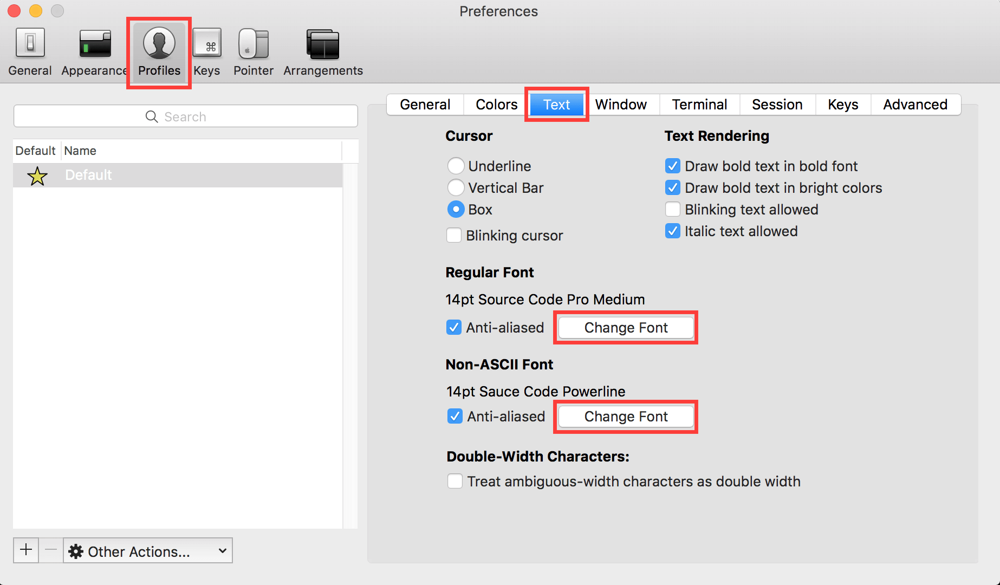
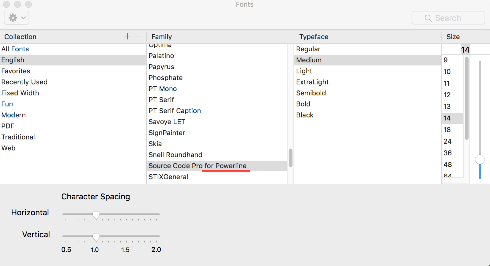

## Fish Shell + iTerm2 + Powerline

在編寫程式及進行系統操作時，我們常常大量地使用 Terminal 終端機與 macOS 預設的 [Bash shell](https://en.wikipedia.org/wiki/Bash_(Unix_shell))。然而，系統預設的 Terminal 與 Bash 看久了實在不是很舒服也相當不方便，因此，這篇開發環境設置筆記將會介紹如何安裝 [Fish Shell](http://fishshell.com/) 與 [Powerline](https://github.com/powerline/powerline) 這個 plugin 在 [iTerm2](https://www.iterm2.com/) 終端機上。這篇開發環境配置筆記會使用到 [Xcode IDE](https://itunes.apple.com/tw/app/xcode/id497799835?mt=12) 的開發環境，並需要安裝 [Homebrew](http://brew.sh/index_zh-tw.html) 套件管理工具以及 iTerm2 終端機，若還沒安裝請點擊連結安裝。

### Note

Open [iTerm2](https://www.iterm2.com/), and run the following commands to install Fish:

```
$ brew install fish
$ echo "/usr/local/bin/fish" | sudo tee -a /etc/shells
$ chsh -s /usr/local/bin/fish
```

Now install Powerline:

```
$ brew install python
$ pip install powerline-status --user
$ pip install git+git://github.com/powerline/powerline
$ git clone https://github.com/milkbikis/powerline-shell
$ cd powerline-shell
$ cp config.py.dist config.py
$ ./install.py
```

Now, edit `~/.config/fish/config.fish` by typing and redefine `fish_prompt` as follow:

```shell
function fish_prompt
    ~/powerline-shell/powerline-shell.py $status --shell bare ^/dev/null
end
```

Install the [Powerline Fonts](https://github.com/powerline/fonts) by typing the commands below:

```
$ git clone https://github.com/powerline/fonts.git
$ cd fonts
$ ./install.sh
```

Finally, go to **iTerm2 Preferences** and click the **Text** tab.



Choose any font style including **for Powerline**



You are all set!

**Fish Shell + iTerm2 + Powerline**


### [Optional]

1. In Fish, the `export` command is not allowed to used to edit our variables, like `$PATH`. If you want to append a new path to your `$PATH` variable, here is a simple way by using `set` command like the example below:

    ```
    $ set PATH $PATH <new_path>
    ```

2. The following command allows you to change shell back to the Bash just in case:

    ```
    $ chsh -s /bin/bash
    ```

3. Since Fish doesn't have good compatibility with Bash, I recommend using Zsh + Oh-My-Zsh as a better option. To do so, see more details [here](../zsh-oh-my-zsh-iterm2-powerline.md).
